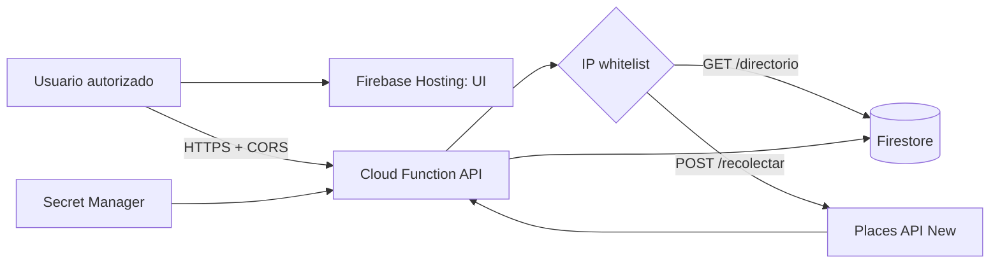

# Documentación técnica

## 1. Objetivo y alcance

El sistema crea un directorio académico de médicos especialistas de Ciudad de
Guatemala a partir de Google Places API (New). Recolecta nombre, especialidad,
dirección, teléfono, sitio web, zona, `place_id`, fecha y keyword; almacena los
datos en Firestore y los expone mediante una API paginada y una UI mínima.

Tecnologías: TypeScript, Node.js 22, Firebase Functions v2, Cloud Firestore,
Firebase Hosting y Local Emulator Suite. El despliegue está en `ria-proyecto1`:

- UI: `https://ria-proyecto1.web.app`
- API: `https://us-central1-ria-proyecto1.cloudfunctions.net/api`

## 2. Arquitectura y seguridad



Hosting sirve archivos estáticos y el navegador llama directamente a la
Function para conservar la IP del usuario. La whitelist es el primer middleware
de la aplicación: una dirección no autorizada recibe HTTP 403 antes de acceder
a Places o Firestore. Se verificaron solicitudes autorizadas y no autorizadas.
CORS acepta únicamente los dominios de Hosting del proyecto y el emulador.

La key de Places está en Secret Manager, nunca en código, Git ni el navegador;
está restringida a Places API (New). Functions v2 no posee IP de salida fija sin
VPC y Cloud NAT, por lo que la restricción por IP de la key requeriría esa
infraestructura adicional. Para este alcance se aplicaron Secret Manager,
restricción por API, cuotas, alertas de billing, máximo tres instancias e IP
whitelist de entrada. Firestore rechaza toda lectura y escritura directa de
clientes; solo Firebase Admin dentro de la Function tiene acceso.

## 3. API y modelo de datos

`POST /recolectar` recibe `keyword`, `zona` y opcionalmente `especialidad`.
Realiza exactamente una Text Search con máscara explícita y `pageSize: 20`; no
sigue páginas adicionales. Usa `place_id` como ID de documento, por lo que una
búsqueda repetida actualiza en lugar de duplicar. También elimina resultados
obsoletos de la misma keyword.

`GET /directorio` acepta `page`, `pageSize` (máximo 50), `especialidad` y
`zona`. Normaliza los filtros, ordena por nombre y devuelve datos, página,
tamaño y `hasNext`. Firestore tiene índices para especialidad, zona y ambos
filtros combinados.

Documento `medicos/{place_id}`:

```text
nombre, especialidad, direccion, telefono, sitio_web, zona, place_id,
fecha_recoleccion, keyword_usado, tipo_principal_google, tipos_google
```

Los dos campos de tipos conservan metadatos originales de Google para auditoría.
Los campos auxiliares normalizados de búsqueda no se exponen como datos médicos.

## 4. Estrategia, costos y calidad

Se documentó una matriz antes de recolectar: `cardiólogo`, `pediatra`,
`dermatólogo`, `ginecólogo` y `neurólogo`, combinados con cuatro zonas relevantes
por especialidad. El script ejecuta 20 búsquedas con siete segundos de pausa,
por debajo de 10 solicitudes por minuto. Se completaron 41 búsquedas exitosas
durante configuración, validación y depuración, dentro de la cuota diaria de 100.
El emulador se usó para pruebas; producción se reservó para integración y demo.

El dataset final contiene 215 `place_id` únicos, cinco especialidades, siete
zonas y las 20 combinaciones planificadas. Hay 16 teléfonos y 98 sitios web
vacíos; no se rellenaron. Los sitios de redes sociales se descartan sin inferir
un reemplazo. Los exports incluyen fecha de recolección.

Validaciones aplicadas: coordenadas dentro de Ciudad de Guatemala, concordancia
de zona cuando Google la indica, categoría médica devuelta por Google y lista
auditable de seis exclusiones confirmadas. No se fusionaron aliases con distintos
`place_id`, porque hacerlo implicaría inferir identidad. El reporte
`docs/datos/cobertura.md` conserva 68 candidatos para revisión visual; no son
errores confirmados y no se eliminan automáticamente.

## 5. Postura ética y limitaciones

El directorio es una referencia académica, no certifica credenciales ni
sustituye una recomendación médica. `especialidad` y `zona` describen la
estrategia de búsqueda, no una verificación independiente. Solo se guardan datos
de Places y metadatos de recolección; no se agregan ni infieren teléfonos,
direcciones, sitios o identidades.

Los datos pueden estar incompletos o desactualizados. La UI muestra la fecha y
advierte esta limitación. Los resultados son los primeros lugares de Text Search,
no un censo exhaustivo. Google puede devolver direcciones o categorías
inconsistentes, por lo que se mantiene revisión humana conservadora.

Los términos de Google Places limitan almacenamiento y redistribución. Este uso
es exclusivamente académico; convertirlo en producto requeriría revisar los ToS
vigentes, condiciones comerciales, actualización periódica y mecanismos de
corrección o retiro.
